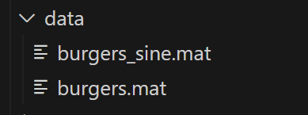

## 一、DeepHPMs模型介绍

1. 背景介绍

深度学习，特别是Physics-informed Neural Networks (PINNs)，革新了偏微分方程(PDEs)的求解方法，通过将物理法则直接融入神经网络训练，有效利用已知PDE公式从稀疏或带有噪声的数据中学习解。而针对PDE公式未知的场景，DeepHPMs等技术兴起，利用双网络架构揭示隐藏的物理规律，从复杂数据中逆推非线性动力学方程，如Burgers方程等，展示了深度学习在预测未知状态与发现物理定律方面的强大潜力。这种方法论不仅限于Burgers方程，也成功应用于KdV、Kuramoto-Sivashinsky、非线性Schrödinger和Navier-Stokes方程等，横跨流体力学至量子物理多个科学领域，标志着从数据到物理定律理解的深度学习新时代。

2. 论文模型

这篇文献提出了一种基于深度学习的方法，用于从散乱且可能含有噪声的空间-时间观测数据中发现非线性偏微分方程。作者Maziar Raissi等人通过两个深度神经网络来逼近未知解和非线性动力学：第一个网络作为对未知解的先验，避免了数值微分的不稳定；第二个网络代表非线性动力学，帮助提炼数据集中演变机制。他们通过几个科学领域的基准问题，包括Burgers、Korteweg-de Vries (KdV)、Kuramoto-Sivashinsky、非线性Schrödinger和Navier-Stokes方程，展示了该框架的效能，能准确学习潜在动力学并预测系统未来状态。

3.论文试验

实验中，他们使用传统的谱方法生成高质量数据集，然后随机子采样创建训练数据子集。例如，在研究Burgers方程时，使用了周期边界条件和初始条件，通过Chebfun包模拟方程至最终时间，获得一系列快照。他们使用5层深网络（每层50个神经元）表示解u，以及2层网络（每层100个神经元）表示非线性函数N，激活函数为sin(x)，并最小化平方误差损失函数来训练这些网络。通过PINNs算法，他们用学习到的方程与原始数据对比，显示了模型能准确识别PDE，相对L2误差为6.28e-03。

4.论文总结

该研究强调了深度学习在发现PDE方面的潜力，特别是在没有直接导数信息或导数近似的情况下。然而，解决混沌系统如Kuramoto-Sivashinsky方程仍具挑战性。作者还指出，虽然深度学习方法有效，但黑盒性质意味着仍需发展通用PDE求解器，且深化合作工作。总体，文章展示了深度学习在发现和预测物理规律上的广阔前景，但同时也指出了当前的一些限制和未来研究方向。

## 二、数据集

- [数据集下载链接](https://download-mindspore.osinfra.cn/mindscience/SciAI/sciai/model/deep_hpms/)
- 数据集介绍

针对Burgers方程的模拟数据，这些数据被组织并存储在.mat文件中，每个文件内以字典形式包含了不同初始化条件下的模拟结果，数据项包括空间坐标x、时间坐标t以及相应的解u。

- burgers.mat:包含了基础或标准初始化条件下Burgers方程的模拟结果。模拟可能是在不同的时间和空间点上进行的，数据通常会包括空间坐标x、时间坐标t以及对应的解u(x,t),解u反映了流体的速度分布随时间和空间的变化情况。
- burgers_sine.mat:特别关注了当初始条件为正弦波形时Burgers方程的模拟。在模拟开始时，流体速度或其相关参数被设置为遵循正弦波的形状。这样的设置在研究波的传播、破碎、激波形成等现象时非常常见。这个数据集不仅有助于探索非线性效应如何影响初始正弦波形的演化，还可能揭示出诸如激波形成和相互作用等复杂动态过程的细节。

- 目录结构如下

```Markdown
├── data
    │   ├── burgers.mat
    │   ├── burgers_sine.mat
```

- 将数据集移到对应的路径：

```Bash
./model/deep_hpms/data
```



## 三、项目需求

- 揭露和预测非线性偏微分方程
- 对高维数据拟合pde公式

## 四、PaddlePaddle在服务器实现版本

### 4.1 项目

- 下载PaddleScience需要下载1.2版本，最新版本的config代码有出入

```Bash
git clone -b release/1.2 https://github.com/PaddlePaddle/PaddleScience.git
```

或

```Bash
git clone https://github.com/PaddlePaddle/PaddleScience.git
git checkout release/1.1
```

### 4.2 服务器环境配置：

4.2.1服务器基础配置

| 系统 | Ubuntu18.04 |
| ---- | ----------- |
| CUDA | 11.3        |
| 显卡 | 2080ti      |

4.2.2创建虚拟环境并且切换到环境：

```Bash
conda create -n paddle python=38
conda activate paddle
```

4.2.3安装依赖包

```Bash
annotated-types==0.7.0
antlr4-python3-runtime==4.9.3
anyio==4.4.0
astor==0.8.1
Babel==2.15.0
bce-python-sdk==0.9.11
blinker==1.8.2
certifi==2024.6.2
charset-normalizer==3.3.2
click==8.1.7
colorlog==6.8.2
contourpy==1.1.1
cycler==0.12.1
decorator==5.1.1
exceptiongroup==1.2.1
Flask==3.0.3
flask-babel==4.0.0
fonttools==4.53.0
future==1.0.0
h11==0.14.0
h5py==3.11.0
httpcore==1.0.5
httpx==0.27.0
hydra-core==1.3.2
idna==3.7
imageio==2.34.1
importlib_metadata==7.1.0
importlib_resources==6.4.0
itsdangerous==2.2.0
Jinja2==3.1.4
joblib==1.4.2
kiwisolver==1.4.5
markdown-it-py==3.0.0
MarkupSafe==2.1.5
matplotlib==3.7.5
mdurl==0.1.2
meshio==5.3.4
mpmath==1.3.0
networkx==3.1
numpy==1.23.1
omegaconf==2.3.0
opencv-python==4.9.0.80
opt-einsum==3.3.0
packaging==24.0
paddlepaddle-gpu==0.0.0.post112
pandas==2.0.3
pillow==10.3.0
platformdirs==4.2.2
pooch==1.8.1
protobuf==3.20.3
psutil==5.9.8
pyaml==24.4.0
pycryptodome==3.20.0
pydantic==2.7.2
pydantic_core==2.18.3
pyevtk==1.6.0
Pygments==2.18.0
pyparsing==3.1.2
python-dateutil==2.9.0.post0
pytz==2024.1
pyvista==0.37.0
PyYAML==6.0.1
rarfile==4.2
requests==2.32.3
rich==13.7.1
scikit-learn==1.3.2
scikit-optimize==0.10.1
scipy==1.10.1
scooby==0.10.0
seaborn==0.13.2
six==1.16.0
sniffio==1.3.1
sympy==1.12.1
threadpoolctl==3.5.0
tqdm==4.66.4
typing_extensions==4.12.1
tzdata==2024.1
urllib3==2.2.1
visualdl==2.5.3
vtk==9.3.0
Werkzeug==3.0.3
wget==3.2
zipp==3.19.1
```

### 4.3 训练过程


- 训练日志存放路径：PaddleScience/output_burgers

## 五、 PaddlePaddle到Mindspore的转换

### 5.1 Paddle与Mindspore算子对比文档

[PaddlePaddle官方文档](https://www.paddlepaddle.org.cn/documentation/docs/zh/api/index_cn.html)

- [PaddleScience Docs](https://paddlescience-docs.readthedocs.io/zh/latest/)

[MindSpore 文档](https://www.mindspore.cn/docs/zh-CN/r2.2/index.html)

- [迁移文档](https://www.mindspore.cn/docs/zh-CN/r2.2/migration_guide/typical_api_comparision.html)
- [sciai算子文档](https://www.mindspore.cn/sciai/docs/zh-CN/r0.1/search.html?q=jacobian&check_keywords=yes&area=default)

### 5.2 PaddlePaddle和MindSpore算子映射关系：

| 功能类别       | PaddlePaddle                                                 | MindSpore                                                    |
| -------------- | ------------------------------------------------------------ | ------------------------------------------------------------ |
| 卷积层         | `paddle.nn.Conv2D`                                           | `mindspore.nn.Conv2d`                                        |
| 批量归一化     | `paddle.nn.BatchNorm2D`                                      | `mindspore.nn.BatchNorm2d`                                   |
| 激活函数       | `paddle.nn.ReLU`<br>`paddle.nn.Sigmoid`                      | `mindspore.nn.ReLU`<br>`mindspore.nn.Sigmoid`                |
| 池化层         | `paddle.nn.MaxPool2D`<br>`paddle.nn.AvgPool2D`               | `mindspore.nn.MaxPool2d`<br>`mindspore.nn.AvgPool2d`         |
| 完全连接层     | `paddle.nn.Linear`                                           | `mindspore.nn.Dense`                                         |
| 优化器         | `paddle.optimizer.Adam`<br>`paddle.optimizer.SGD`            | `mindspore.nn.Adam`<br>`mindspore.nn.SGD`                    |
| 损失函数       | `paddle.nn.CrossEntropyLoss`<br>`paddle.nn.MSELoss`          | `mindspore.nn.SoftmaxCrossEntropyWithLogits`<br>`mindspore.nn.MSELoss` |
| 数据加载和转换 | `paddle.io.DataLoader`<br>`paddle.vision.transforms`         | `mindspore.dataset`<br>`mindspore.dataset.transforms`        |
| 数据增强       | `paddle.vision.transforms.RandomResizedCrop`<br>`paddle.vision.transforms.Normalize` | `mindspore.dataset.transforms.RandomCrop`<br>`mindspore.dataset.transforms.Normalize` |

## 六、Mindspore在服务器实现版本

### 6.1 MindSpore框架介绍

MindSpore是一个高度灵活、高效且广泛适用的深度学习框架，通过其精心设计的架构层次，致力于为开发者提供从开发到部署的全方位便捷体验，并推动人工智能技术在多领域的深入应用。

- 框架目标：
  - 易开发：强调API友好性和低调试难度，便于用户快速上手和调试深度学习模型。
  - 高效执行：覆盖计算、数据预处理及分布式训练的高效率，确保模型训练和推理的性能。
  - 全场景覆盖：支持云、边缘、端侧全场景应用，满足多样化部署需求。
- 总体架构核心组成部分：
  - MindSpore Extend（扩展层）：
    1. 开发者参与平台，鼓励社区贡献，共同构建框架扩展功能。
  - MindExpression（ME，前端表达层）：
    1. 基于Python的高级API设计，计划拓展C/C++、Java等前端支持。
    2. 探索支持华为自研语言“仓颉”，及与Julia等第三方语言对接，增强生态兼容性。
  - MindCompiler（编译优化层）：
    1. 关键技术层，基于MindIR实现跨硬件优化。
    2. 功能涵盖硬件无关与相关优化（如自动微分、内存管理、图算融合）及推理优化（量化、剪枝）。
    3. MindAKG作为自动算子生成工具，持续升级，提升编译效率。
  - MindRT（全场景运行时）：
    1. 支持云、边缘、IoT等多种设备环境的运行，实现全场景部署能力。
- 技术创新亮点：
  - **统一架构下的全场景适应性：**确保模型在不同设备间无缝迁移和高效运行。
  - **前端语言多元化探索：**开放多元的前端接入，扩大开发者基础和应用领域。
  - **深度优化的编译系统：**确保深度学习任务在各类硬件上的高性能执行。


### 6.2 服务器环境配置：

6.2.1服务器基础配置

| 系统 | Ubuntu18.04 | Mindspore的DeepHPMs训练只能在GPU和Ascend上训练，而Mindspore在windows操作系统上仅能安装cpu版本，因此选在在linux内核的操作系统中进行环境部署 |
| ---- | ----------- | ------------------------------------------------------------ |
| CUDA | 11.1        | 对cuda版本要求比较高：mindspore的gpu版本只支持cuda11.1 cuda11.6而sciai仅支持cuda11.1  python==3.7综上：选择安装cuda11.1 |
| 显卡 | 2080ti      | GPU                                                          |


6.2.2创建虚拟环境并且切换到环境：

```Bash
conda create -n mindspore python=3.7
conda activate mindspore
```

6.2.3安装依赖包

```Bash
asttokens==2.4.1
astunparse==1.6.3
certifi @ file:///croot/certifi_1671487769961/work/certifi
cftime==1.6.2
cycler==0.11.0
filelock==3.12.2
fonttools==4.38.0
joblib==1.3.2
kiwisolver==1.4.5
matplotlib==3.5.3
mindspore @ https://ms-release.obs.cn-north-4.myhuaweicloud.com/2.2.14/MindSpore/unified/x86_64/mindspore-2.2.14-cp37-cp37m-linux_x86_64.whl
mpi4py @ file:///croot/mpi4py_1671223370575/work
netCDF4==1.6.4
numpy==1.21.6
Ofpp==0.1
packaging==24.0
pandas==1.1.5
Pillow==9.5.0
protobuf==4.24.4
psutil==5.9.8
pyaml==23.5.8
pyDOE==0.3.8
pyparsing==3.1.2
python-dateutil==2.9.0.post0
pytz==2024.1
PyYAML==6.0.1
sciai @ https://ms-release.obs.cn-north-4.myhuaweicloud.com/2.2.0/MindScience/sciai/gpu/x86_64/cuda-11.1/sciai-0.1.0-cp37-cp37m-linux_x86_64.whl
scikit-learn==1.0.2
scikit-optimize==0.9.0
scipy==1.7.3
seaborn==0.12.2
six==1.16.0
threadpoolctl==3.1.0
tikzplotlib==0.10.1
typing_extensions==4.7.1
webcolors==1.13
```

6.2.4MindSpore_gpu安装

- 服务器支持环境


- 安装脚本

```Bash
pip install https://ms-release.obs.cn-north-4.myhuaweicloud.com/2.2.14/MindSpore/unified/x86_64/mindspore-2.2.14-cp38-cp38-linux_x86_64.whl --trusted-host ms-release.obs.cn-north-4.myhuaweicloud.com -i https://pypi.tuna.tsinghua.edu.cn/simple
```

- 验证是否安装成功：

```Bash
python -c "import mindspore;mindspore.set_context(device_target='CPU');mindspore.run_check()"
```


6.2.5 sciai_g安装

- 要求：
  - cuda11.1
  - python3.7
  - linux_x86_64
  - mindspore2.2.0

```Bash
pip install https://ms-release.obs.cn-north-4.myhuaweicloud.com/2.2.0/MindScience/sciai/gpu/x86_64/cuda-11.1/sciai-0.1.0-cp37-cp37m-linux_x86_64.whl -i https://pypi.tuna.tsinghua.edu.cn/simple
```

### 6.3 模型迁移

| paddle.to_tensor([10.0])                                     | Tensor([0.0])                                                |
| ------------------------------------------------------------ | ------------------------------------------------------------ |
| t = 2.0 * (t - t_lb) * paddle.pow((t_ub - t_lb), -1) - 1.0   | t = 2.0 * (t - t_lb) * ops.pow((t_ub - t_lb), -1) - 1.0      |
| rel_l2 = paddle.norm(output_dict["du_t"] - output_dict["f_pde"]) / paddle.norm(    #     output_dict["du_t"] | rel_l2 = ops.norm(output_dict["du_t"] - output_dict["f_pde"]) / ops.norm(        output_dict["du_t"]    ) |
| # u_lb, u_ub = paddle.split(u_b, 2, axis=0)                  | u_lb, u_ub = ops.split(u_b, 2, axis=0)                       |
| ppsci                                                        | sciai                                                        |

### 6.4 训练过程

- 在2080ti上采用GPU进行训练

```Bash
python train.py \    
    --problem burgers_different \    
    --u_layers 2 50 50 50 50 1 \    
    --pde_layers 3 100 100 1 \    
    --layers 2 50 50 50 50 1 \    
    --save_ckpt true \    
    --load_ckpt false \    
    --save_ckpt_path ./checkpoints \    
    --load_ckpt_path ./checkpoints/burgers_diff_final.ckpt \    
    --save_fig true \    
    --figures_path ./figures \    
    --load_data_idn_path ./data/burgers_sine.mat \    
    --load_data_sol_path ./data/burgers.mat \    
    --log_path ./logs \    
    --lr 1e-3 \    
    --train_epoch 30001 \    
    --train_epoch_lbfgs 100 \    
    --print_interval 100 \    
    --lb_idn 0.0 -8.0 \    
    --ub_idn 10.0 8.0 \    
    --lb_sol 0.0 -8.0 \    
    --ub_sol 10.0 8.0 \    
    --download_data deep_hpms \    
    --force_download false \    
    --data_type float32 \    
    --amp_level O3 \    
    --device_id 0 \    
    --mode 0
```

### 6.5 运行结果截图如下


### 6.6 代码运行步骤

数据处理

```Python
def prepare(problem=None):
    abs_dir = os.path.abspath(os.path.dirname(__file__))
    with open(f"{abs_dir}/../config.yaml") as f:
        config_dict = yaml.safe_load(f)
    if problem is not None:
        config_dict["problem"] = problem
    args_, problem_ = generate_args(config_dict)
    return args_, problem_

def generate_args(config):
    """generate arguments"""
    common_config = {k: v for k, v in config.items() if not isinstance(v, dict)}
    problem_name = find_problem(config)
    problem_config = config.get(problem_name)
    concat_config = {**common_config, **problem_config}
    args = parse_arg(concat_config)
    problem = {
        "burgers_different": DeepHPMBurgersDiff,
        "kdv_same": DeepHPMKdvSame
    }.get(problem_name, DeepHPMBurgersDiff)
    return args, problem

def find_problem(config):
    """find problem according to config case"""
    parser = argparse.ArgumentParser(description=config.get("case"))
    parser.add_argument(f'--problem', type=str, default=config.get("problem", "burgers_different"))
    args = parser.parse_known_args()
    return args[0].problem

def load_data(args, dtype):
    """load data"""
    # Domain bounds
    lb_idn, ub_idn, lb_sol, ub_sol = \
        np.array(args.lb_idn), np.array(args.ub_idn), np.array(args.lb_sol), np.array(args.ub_sol)

    # identification
    data_idn = scipy.io.loadmat(args.load_data_idn_path)
    t_idn, x_idn = flatten_add_dim(data_idn['t'], data_idn['x'])
    t_idn_, x_idn_ = np.meshgrid(t_idn, x_idn)
    exact_idn_ = np.real(data_idn['usol'])
    index = int(2 / 3 * t_idn.shape[0])
    t_idn_, x_idn_, exact_idn_ = t_idn_[:, :index], x_idn_[:, :index], exact_idn_[:, :index]
    t_idn_star, x_idn_star, u_idn_star = flatten_add_dim(t_idn_, x_idn_, exact_idn_)
    n_train = 10000
    idx = np.random.choice(t_idn_star.shape[0], n_train, replace=False)
    t_train, x_train, u_train = t_idn_star[idx, :], x_idn_star[idx, :], u_idn_star[idx, :]
    noise = 0.00
    u_train = u_train + noise * np.std(u_train) * np.random.randn(*u_train.shape)

    # solution
    data_sol = scipy.io.loadmat(args.load_data_sol_path)
    t_sol, x_sol = flatten_add_dim(data_sol['t'], data_sol['x'])
    t_sol_, x_sol_ = np.meshgrid(t_sol, x_sol)
    exact_sol_ = np.real(data_sol['usol'])
    t_sol_star, x_sol_star, u_sol_star = flatten_add_dim(t_sol_, x_sol_, exact_sol_)
    x_sol_star_ = np.hstack((t_sol_star, x_sol_star))
    n0, n_b = exact_sol_.shape
    idx_x = np.random.choice(x_sol.shape[0], n0, replace=False)
    idx_t = np.random.choice(t_sol.shape[0], n_b, replace=False)
    tb_train, x0_train, u0_train = t_sol[idx_t, :], x_sol[idx_x, :], exact_sol_[idx_x, :1]
    n_f = 20000
    x_f_train_ = lb_sol + (ub_sol - lb_sol) * lhs(2, n_f)

    tensors = to_tensor((lb_idn, ub_idn, lb_sol, ub_sol, t_train, x_train, u_train, t_idn_star, x_idn_star, u_idn_star,
                         x_f_train_, tb_train, x0_train, u0_train, t_sol_star, x_sol_star, u_sol_star), dtype)

    return x_sol_star_, exact_sol_, t_sol_, x_sol_, tensors
```

网络架构

```Python
class IdnNetFBurgersDiff(IdnNetF):
    """
    idn_net_f burgers diff
    """

    def construct(self, t, x):
        """Network forward pass"""
        u = self.idn_net_u(t, x)
        u_t, u_x = self.grad_net(t, x)
        u_xx = self.grad_net_uxx(t, x)
        terms = ops.concat([u, u_x, u_xx], 1)
        f = u_t - self.net_pde(terms)
        return f

class DeepHPMBurgersDiff(DeepHPM):
    """
    Deep hpms burgers different.
    """

    def case_idn_net_f(self):
        return IdnNetFBurgersDiff(self.idn_net_u, self.net_pde)

    def case_sol_net(self, lb_sol, ub_sol):
        return SolNetBurgersDiff(self.net, lb_sol, ub_sol, self.net_pde)

    def sol_predict(self, t_star, x_star):
        u_star, _, _ = self.sol_net.sol_net_u(t_star, x_star)
        f_star = self.sol_net.sol_net_f(t_star, x_star)
        return u_star, f_star

    def eval_idn(self, t_idn_star, x_idn_star, u_idn_star):
        u_pred_identifier, _ = self.idn_predict(t_idn_star, x_idn_star)
        error_u_identifier = SSE()(u_idn_star - u_pred_identifier) / SSE()(u_idn_star)
        print_log(f'Error u: {error_u_identifier}')

    def eval_sol(self, *inputs):
        t_sol_star, u_sol_star, x_sol_star, _, _, _ = inputs
        u_pred, _ = self.sol_predict(t_sol_star, x_sol_star)
        error_u = SSE()(u_sol_star - u_pred) / SSE()(u_sol_star)
        print_log(f'Error u: {error_u}')
        return u_pred

class SolNetBurgersDiff(SolNet):
    """
    sol_net burgers different case.
    """

    def construct(self, *inputs):
        """Network forward pass"""
        t0, x0, u0, t_lb, x_lb, t_ub, x_ub, t_f, x_f = inputs
        u0_pred, _, _ = self.sol_net_u(t0, x0)
        u_lb_pred, u_x_lb_pred, _ = self.sol_net_u(t_lb, x_lb)
        u_ub_pred, u_x_ub_pred, _ = self.sol_net_u(t_ub, x_ub)
        sol_f_pred = self.sol_net_f(t_f, x_f)

        sol_loss = self.sse(u0 - u0_pred) + \
                   self.sse(u_lb_pred - u_ub_pred) + \
                   self.sse(u_x_lb_pred - u_x_ub_pred) + \
                   self.sse(sol_f_pred)
        return sol_loss

    def sol_net_u(self, t, x):
        u = self.net(t, x)
        u_t, u_x = self.grad_net(t, x)
        return u, u_x, u_t

    def sol_net_f(self, t, x):
        u, u_x, u_t = self.sol_net_u(t, x)
        u_xx = self.grad_net_uxx(t, x)
        terms = ops.concat([u, u_x, u_xx], 1)
        f = u_t - self.net_pde(terms)
        return f
```

### 6.7 试验结果

在GPU上进行评估：

- 日志文件保存在./logs
- 结果图片保存在figures_path中，默认位于./figures

```Bash
python eval.py
```


